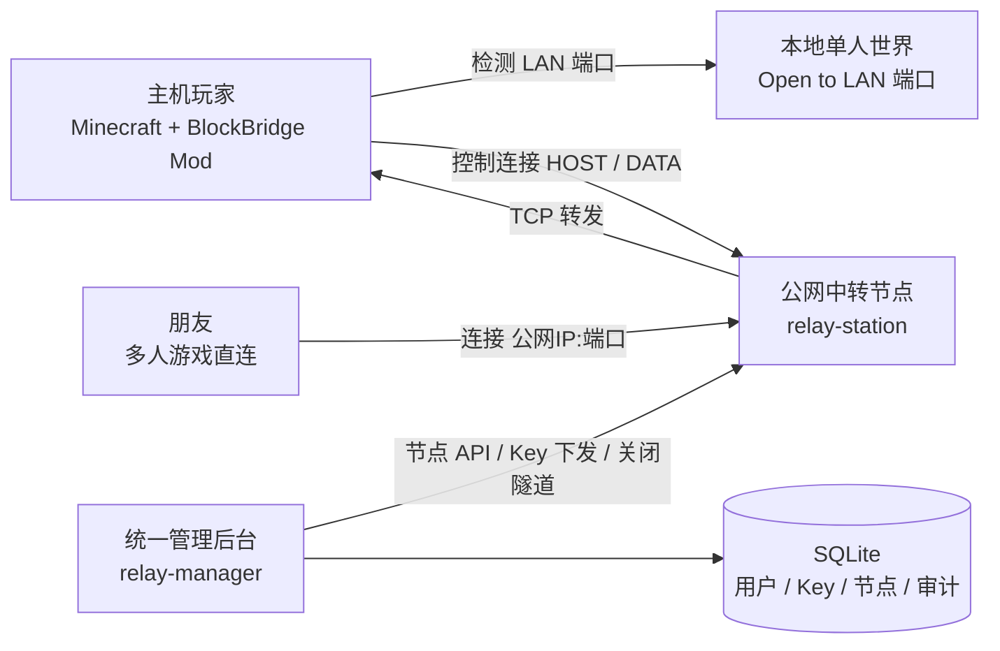
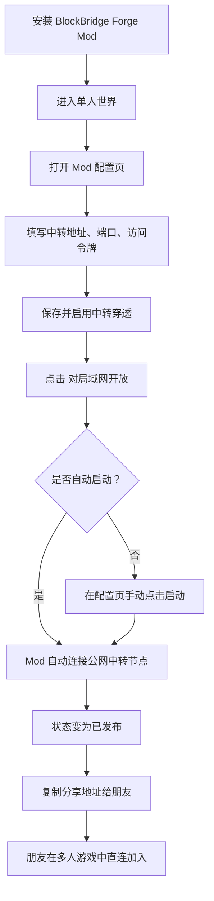
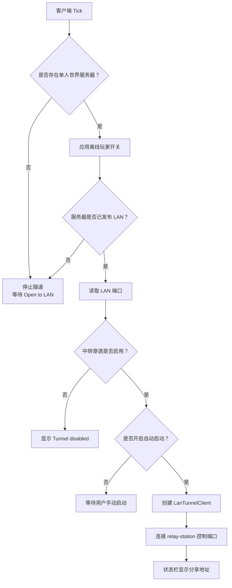
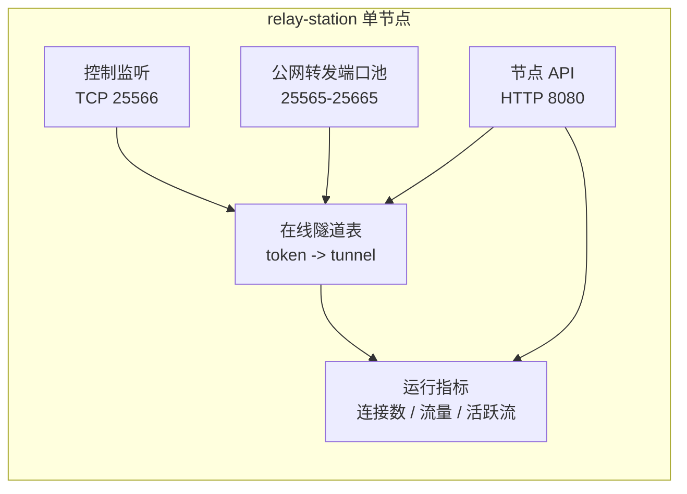
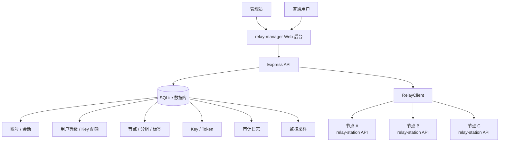
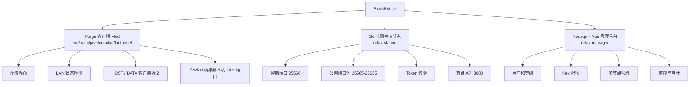

# BlockBridge：把 Minecraft 单人世界发布到公网，朋友无需同一局域网也能加入

你是否遇到过这样的情况：想和朋友玩 Minecraft，但双方不在同一个网络；家里没有公网 IP；路由器端口映射不会配，或者运营商网络根本不允许外部访问。

这类问题本质上不是 Minecraft 的玩法问题，而是网络可达性问题。Minecraft 的“对局域网开放”只会把单人世界发布到本机所在局域网，外网玩家无法直接连进来。BlockBridge 要解决的就是这一步：让主机玩家不需要公网 IP，也能把本地 Open to LAN 世界通过公网中转节点发布出去。

BlockBridge 是一个面向 Minecraft Forge 1.20.1 的局域网联机穿透项目，包含三个部分：

- Forge 客户端 Mod：在玩家电脑上运行，检测局域网世界并连接中转节点。
- Go 公网中转节点：部署在云服务器上，负责 TCP 流量转发。
- Node.js + Vue + SQLite 管理后台：统一管理节点、用户等级、Key、监控和审计日志。

最终玩家看到的体验很简单：主机打开单人世界，点击“对局域网开放”，配置页出现一个可分享地址，朋友在多人游戏里直接连接这个公网地址即可。


> 发布公众号前建议将截图中的访问令牌打码；上图用于展示配置入口、状态栏和分享地址的最终效果。

## 为什么要做这个项目

Minecraft 原生的 Open to LAN 适合宿舍、网吧、家庭 Wi-Fi 这种同一局域网场景。但现实里，玩家常常处在不同网络环境：

- 一个人在家，一个人在学校；
- 宽带没有公网 IPv4；
- 不想折腾路由器端口映射；
- 临时组织联机，希望越简单越好；
- 想让不同等级用户使用不同节点，方便维护和运营。

传统方案要么依赖虚拟局域网工具，要么需要手动部署服务器，要么需要公网 IP。BlockBridge 的思路是：主机客户端主动连接公网中转服务器，由公网节点代替主机暴露端口。这样主机只需要能访问公网，不需要被公网主动访问。

## 整体架构

BlockBridge 不是单个 Mod 文件，而是一套完整的“客户端 + 中转节点 + 管理后台”方案。



这张图可以概括整个系统的分工：

- 客户端 Mod 不监听公网端口，只主动连中转服务。
- relay-station 处理真实的 Minecraft TCP 流量。
- relay-manager 不参与游戏流量，只负责管理和监控。
- SQLite 保存用户、等级、节点、Key、监控采样和审计日志。

这样的拆分有一个好处：流量转发节点可以横向扩展，管理后台可以统一纳管多个节点。后续如果要增加区域节点、等级限制或用户配额，不需要改客户端 Mod 的核心协议。

## 玩家使用流程

从玩家角度看，BlockBridge 的使用路径尽量贴近 Minecraft 原生流程。



配置项也尽量保持直观：

| 配置项 | 作用 |
|---|---|
| 启用中转穿透 | 总开关，关闭后不会连接公网节点 |
| 开启局域网后自动启动 | Open to LAN 后自动发布公网端口 |
| 允许离线玩家加入 | 可关闭正版验证，适合离线模式联机 |
| 中转服务器地址 | 公网服务器 IP 或域名 |
| 控制端口 | 默认 `25566` |
| 访问令牌 | 管理后台或节点配置中生成的 Key |
| 公网端口 | 想暴露的端口，填 `0` 可让节点自动分配 |
| 重连间隔秒 | 控制连接断开后的重连等待时间 |

## 一次连接是怎样建立的

BlockBridge 的协议很轻量，核心命令只有几类：`HOST`、`OPEN`、`DATA`。

主机玩家打开 LAN 世界后，客户端会向中转节点发起控制连接：

```text
HOST <token> <requestedPublicPort>
```

中转节点校验令牌，绑定一个公网端口，然后返回：

```text
OK <publicPort> ready
```

当朋友连接这个公网端口时，中转节点不会直接连玩家电脑，因为玩家电脑通常在 NAT 后面。它会通过控制连接通知客户端：

```text
OPEN <connectionId>
```

客户端收到后，再主动新建一条数据连接：

```text
DATA <token> <connectionId>
```

随后，中转节点把朋友的 TCP 连接和客户端的数据连接配对，客户端再把数据转发到本机 `127.0.0.1:<LAN端口>`，Minecraft 联机流量就这样跑通了。

```mermaid
sequenceDiagram
    participant H as 主机 Mod
    participant L as 本地 LAN 世界
    participant R as 公网中转节点
    participant F as 朋友客户端

    H->>R: HOST token requestedPort
    R-->>H: OK publicPort ready
    F->>R: 连接 公网IP:publicPort
    R-->>H: OPEN connectionId
    H->>R: DATA token connectionId
    H->>L: 连接 127.0.0.1:LAN端口
    R<->>H: 双向转发 Minecraft TCP 流量
    H<->>L: 双向转发本地游戏流量
    F<->>R: 正常多人游戏连接
```

这个设计的关键点是：所有来自玩家电脑的连接都是“主动向外发起”的。也就是说，玩家不需要公网 IP，也不需要在家庭路由器上开放端口。

## 客户端 Mod 做了什么

Forge Mod 部分位于：

```text
src/main/java/com/lxd/lantunnel
```

它的职责主要有四个：

1. 读取并保存配置文件；
2. 每秒检测一次单人世界是否已经 Open to LAN；
3. 根据配置自动启动或停止穿透连接；
4. 在配置界面展示本地端口、公网端口、连接状态和分享地址。

客户端启动逻辑如下：



其中 `LanTunnelClient` 负责维持控制连接和数据连接，`TunnelIo` 负责把两个 Socket 的字节流互相复制。这里没有引入复杂协议层，Minecraft 客户端看到的仍然是普通 TCP 连接。

## 中转节点为什么用 Go 写

relay-station 是独立 Go 项目：

```text
relay-station
```

它只做节点侧能力：

- 监听控制端口，默认 `25566`；
- 在公网端口范围内绑定转发端口，默认 `25565-25665`；
- 校验访问令牌；
- 管理在线隧道；
- 接受朋友连接；
- 通知客户端建立数据连接；
- 统计连接数、流量、活跃隧道；
- 提供节点 HTTP API，默认 `8080`。

节点运行后，真正承载游戏流量的是 Go 的 TCP 转发逻辑；管理后台只通过 API 查询状态和下发 Key。这样可以避免把游戏流量压到管理平台上，也便于多个节点分散部署。



生产环境建议：

- 控制端口和公网端口范围对玩家开放；
- 节点 API 端口只允许管理服务器访问；
- 访问令牌不要写死在文章、截图或公开仓库中；
- 云服务器安全组和系统防火墙都要放行对应端口。

## 管理后台解决了什么问题

如果只有一个中转节点，手写 JSON 配置还能接受。但当你想做多节点、用户分级、Key 配额和审计时，就需要一个统一后台。

relay-manager 使用 Node.js + Vue + SQLite，主要提供：

- 管理员和普通用户账号；
- 一级、二级、三级用户等级；
- 不同等级对应不同 Key 上限；
- 节点分组、标签和最低可用等级；
- 用户只能看到自己等级可用的节点；
- 用户创建 Key 时自动同步到对应 relay-station；
- 每分钟采样节点状态；
- 展示流量、连接趋势和在线隧道；
- 记录登录、用户、等级、节点、Key 等关键操作的审计日志。

管理后台与中转节点的关系如下：



这也让 BlockBridge 更适合做成长期服务，而不只是一次性脚本。

## 项目结构

当前项目结构可以这样理解：

```text
BlockBridge
├─ src/main/java/com/lxd/lantunnel
│  ├─ LanTunnelMod.java              # Forge Mod 入口
│  ├─ client
│  │  ├─ ClientTunnelEvents.java     # 检测 Open to LAN 状态
│  │  └─ LanTunnelConfigScreen.java  # 游戏内配置界面
│  ├─ config
│  │  └─ LanTunnelConfig.java        # 客户端配置读写与校验
│  └─ tunnel
│     ├─ LanTunnelManager.java       # 隧道生命周期管理
│     ├─ LanTunnelClient.java        # 控制连接和数据连接
│     ├─ Protocol.java               # 行协议读写
│     ├─ TunnelIo.java               # Socket 双向桥接
│     └─ TunnelStatus.java           # 状态数据
│
├─ relay-station
│  ├─ main.go                        # Go 节点入口
│  ├─ relay.go                       # TCP 中转核心
│  ├─ api.go                         # 节点管理 API
│  ├─ config.go                      # 节点配置和 Token 存储
│  ├─ protocol.go                    # 协议和流量桥接
│  └─ config/station.json            # 节点配置
│
└─ relay-manager
   ├─ server
   │  ├─ index.js                    # Express API 和路由
   │  ├─ store.js                    # SQLite 存储和迁移
   │  ├─ relay-client.js             # 调用 relay-station API
   │  └─ metrics.js                  # 节点状态采样
   └─ client/src
      ├─ App.vue                     # Vue 管理后台主界面
      └─ components                  # 等级徽章、趋势图组件
```

也可以用一张结构图表达：



## 部署方式

客户端 Mod 使用 Gradle 构建：

```powershell
.\gradlew build
```

构建后的 Mod 文件位于：

```text
build/libs/lan_tunnel-0.1.0.jar
```

中转节点单独构建：

```bash
cd relay-station
go build -o bin/relay-station .
./bin/relay-station --config config/station.json
```

Windows 下可以使用：

```powershell
cd relay-station
go build -o bin\relay-station.exe .
.\bin\relay-station.exe --config .\config\station.json
```

管理后台部署：

```bash
cd relay-manager
npm install
npm run build
npm run start
```

默认访问地址：

```text
http://管理服务器IP:8090
```

默认端口规划：

| 服务 | 默认端口 | 说明 |
|---|---:|---|
| relay-station 控制端口 | `25566` | Mod 主动连接 |
| relay-station 公网转发端口 | `25565-25665` | 朋友连接的 Minecraft 地址 |
| relay-station 节点 API | `8080` | 仅供管理后台调用 |
| relay-manager 管理后台 | `8090` | 管理员和用户访问 |

## 这个项目适合谁

BlockBridge 更适合这些场景：

- 没有公网 IP，但想快速和朋友联机；
- 不想让玩家手动配置端口映射；
- 想把 Minecraft 单人世界临时发布给外网朋友；
- 想搭建自己的联机穿透节点；
- 想做用户分级、Key 配额和多节点管理；
- 希望客户端体验接近“打开 LAN 后自动获得分享地址”。

它并不是替代大型 Minecraft 服务端的方案。如果你要长期运行大型公开服务器，仍然建议直接部署独立服务端。但如果你的目标是“我开单人世界，朋友马上能进”，BlockBridge 正好切中这个需求。

## 最后

Minecraft 联机最麻烦的地方，很多时候不是游戏本身，而是网络环境。BlockBridge 把“主机没有公网 IP”这个问题拆成了三个清晰部分：

- 客户端负责感知游戏状态；
- 中转节点负责公网可达和 TCP 转发；
- 管理后台负责用户、Key、节点和监控。

玩家只需要关心一件事：打开世界，复制分享地址，开玩。

如果你也经常因为端口映射、公网 IP、校园网或家庭宽带 NAT 卡住，BlockBridge 就是为这种场景准备的。

